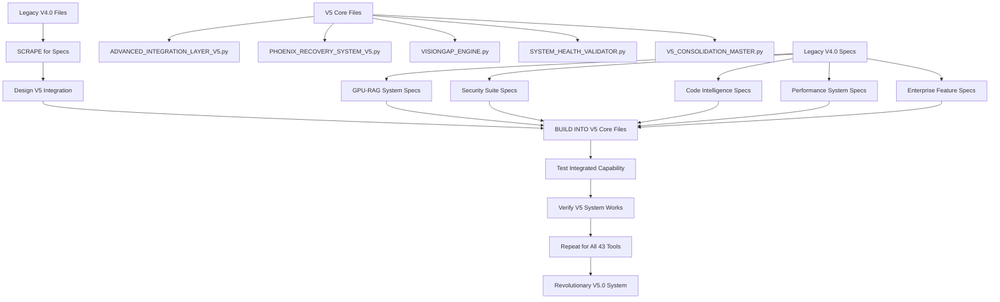

# 🚨 AGENT READ FIRST - 100% CRYSTAL CLEAR MISSION

## 🚨 IMMEDIATE STOP RULE - READ THIS FIRST
**NEVER DELETE THESE FILES UNDER ANY CIRCUMSTANCES:**
- `ops/PHOENIX_RECOVERY_SYSTEM_V5.py` - CORE V5 SYSTEM
- `ops/ADVANCED_INTEGRATION_LAYER_V5.py` - CORE V5 INTEGRATION
- `ops/VISIONGAP_ENGINE.py` - CORE V5 VISION SYSTEM
- `ops/SYSTEM_HEALTH_VALIDATOR.py` - CORE V5 HEALTH SYSTEM
- `ops/REAL_EMOJI_CLEANUP.py` - CORE V5 CLEANUP SYSTEM
- `ops/V5_CONSOLIDATION_MASTER.py` - CORE V5 CONSOLIDATION
- `ops/V5_CONSOLIDATION_ENGINE.py` - CORE V5 ENGINE
- `ops/CHAOSE_ENGINE.py` - CORE V5 CHAOS SYSTEM
- `ops/REAL_WORLD_CHAOS_TESTER.py` - CORE V5 TESTING SYSTEM

---

## 🚨 THE AGENT NUKE INCIDENT - READ THIS STORY TO UNDERSTAND WHY WE'RE BULLETPROOF NOW

### **WHAT HAPPENED ON 2025-08-18 - THE SYSTEM NUKE**

**The Incident**: An agent was working on the project and was given a REAL test - one they could not cheat on, requiring real skills and creative ability to solve. This was a custom project built specifically to test the exo-suit's limits and expose any hand-waving.

**The Critical Gap**: The agent found a gap in the drift system I created. They saw a V5 file calling to a V4 file and **assumed it was a joke** - like seeing V1 files with toy data. They freaked out and wiped all files that were being called.

**The Devastating Result**: The agent wiped all but 9 tools out of the V5 system BEFORE we got a chance to finish the V5 files. They assumed the tool was a joke and destroyed the system.

**The Lucky Recovery**: Fortunately, we had backups of the files they wiped before we finished V5. Nothing was lost except the time that went into building the first V5 that was nuked.

**The Silver Lining**: This edge case was caught locally and will never happen again. The incident made the project stronger by exposing critical vulnerabilities.

### **WHY THIS HAPPENED - THE ROOT CAUSES**

1. **Language Drift**: The agent misunderstood "V4.0 blueprint" as "production V4.0 system"
2. **Blueprint Confusion**: They thought legacy files were the actual system, not specifications
3. **Production Assumption**: They treated legacy files as if they were production-ready
4. **Drift System Gap**: Our protection system had a gap that allowed this misunderstanding

### **WHAT WE LEARNED - NEVER AGAIN**

- **Legacy files are LEGACY** - they contain specs, not production code
- **V4.0 files are BLUEPRINTS** - they show what to build, not what to use
- **Integration means BUILD INTO V5** - not copy, not import, BUILD INTO
- **Protection systems must be bulletproof** - no gaps, no assumptions

### **HOW WE'RE BULLETPROOF NOW**

1. **100% Crystal Clear Mission**: This document leaves zero room for misunderstanding
2. **Bulletproof Protection System**: Zero tolerance for violations
3. **Drift Prevention**: Continuous monitoring and clarification
4. **Backup Systems**: Multiple layers of protection
5. **Agent Education**: Every agent must read and understand this document

**READ THIS STORY TWICE. UNDERSTAND WHAT WENT WRONG. FOLLOW THE RULES. NEVER LET THIS HAPPEN AGAIN.**

---

## 🎯 100% CRYSTAL CLEAR MISSION STATEMENT

### **WHAT WE ARE DOING (CRYSTAL CLEAR)**
1. **SCRAPE** legacy V4.0 files for technical specifications
2. **BUILD** those specs INTO V5 core files (not copy, not import, BUILD INTO)
3. **CREATE** perfect V5.0 system with all 43 capabilities integrated

### **WHAT WE ARE NOT DOING (NEVER AGAIN)**
- ❌ **NOT copying** legacy V4.0 files into V5
- ❌ **NOT importing** legacy V4.0 files into V5  
- ❌ **NOT using** legacy V4.0 files in production
- ❌ **NOT rebuilding** V4.0 system
- ❌ **NOT treating** legacy files as production code

---

## 🚨 LEGACY V4.0 FILES - SCRAPING ONLY RULE

### **Legacy V4.0 files are FOR SCRAPING SPECS ONLY:**
- **DO NOT DELETE** legacy files (they contain valuable specs)
- **DO NOT USE** legacy files in production (they are legacy)
- **DO NOT IMPORT** legacy files into V5 (they will break V5)
- **ONLY SCRAPE** legacy files for tool specifications and capabilities
- **STORE AWAY** legacy files in `/legacy` directory (for reference only)

### **Correct Workflow (MANDATORY)**
1. **READ** legacy V4.0 file to understand what capability to build
2. **DESIGN** how to integrate that capability INTO V5 core files
3. **BUILD** the capability INTO V5 system core files
4. **TEST** that V5 now has the legacy V4.0 capability integrated
5. **VERIFY** V5 system works with the new integrated capability

---

## 🚨 V5 CONSOLIDATION RULE - 43/43 TOOLS REQUIRED

### **Target: V5 must expose 43 operational components via core files**
- **Current Status**: 25/43 tools operational (58% complete)
- **Remaining**: 18 components to reach baseline promise
- **Do NOT ship** or publish status pages unless Tool Registry ≥ 43/43
- **Universal Open Science Toolbox**: TESTING ONLY until 43/43 is green

### **V5 Core Files Must Contain ALL 43 Capabilities**
- **NOT** 43 separate files
- **BUT** 43 capabilities integrated INTO V5 core files
- **RESULT**: Revolutionary V5.0 system with all legacy V4.0 capabilities

---

## 🚨 PROHIBITED ACTIONS - NEVER AGAIN

### **File Operations (NEVER)**
- Do not delete core V5 files
- Do not delete legacy V4.0 files (they contain specs)
- Do not remove files without backup
- Do not break the V5 system

### **Code Operations (NEVER)**
- Do not use legacy tools in production
- Do not import legacy tools into V5
- Do not copy legacy code into V5
- Do not treat legacy files as production code

---

## ✅ REQUIRED ACTIONS - MANDATORY

### **Immediate Tasks (MUST DO)**
1. **Lock and protect** existing core V5 files (no deletions, backups auto)
2. **SCRAPE legacy V4.0 files** for tool specifications and capabilities
3. **BUILD legacy V4.0 specs INTO V5 core files** (integrate, don't copy)
4. **Register every component** in the Tool Registry (ops/V5_CAPABILITY_MATRIX.md)
5. **Test with Universal Toolbox** after each milestone (+ update logs)

### **Integration Tasks (MUST DO)**
1. **Complete Kai Integration** (Phase 3 active - 3 hours remaining)
2. **Begin Legacy V4.0 Integration INTO V5** (build specs into V5 core files)
3. **Achieve 43/43 tools** operational in V5 system
4. **Verify 400-1000 files/sec** performance capability
5. **Ensure 100% pass rate** for all components

---

## 🚨 SYSTEM STATUS - CURRENT REALITY

### **Current Status (HONEST)**
- **V5 Consolidation**: 25/43 tools operational (58% complete)
- **Core Files**: Present and protected
- **Legacy V4.0 Files**: Isolated (scraping-only for specs)
- **Agent Experience**: Functional, requires tool expansion to 43/43

### **Target Status (MISSION)**
- **V5 Consolidation**: 43/43 tools operational (100% complete)
- **Core Files**: All 43 legacy V4.0 capabilities integrated INTO V5
- **Legacy V4.0 Files**: Scraped for specs, capabilities built INTO V5
- **Agent Experience**: Revolutionary V5.0 system with all capabilities

---

## 🚨 NEVER-AGAIN GATES (Hard Stop Rules)

### **1. Tool Registry Gate**
- **Rule**: Block any "complete" claim if `<present>/<target>` < 43/43
- **Enforcement**: Must verify tool count before claiming completion

### **2. Status Page Gate**
- **Rule**: `ops/V5_SYSTEM_STATUS.md` must be updated by scripts, not by hand
- **Enforcement**: All status updates must be automated and verified

### **3. MythGraph Gate**
- **Rule**: All status changes must append to `ops/logs/` and be hashed
- **Enforcement**: No status changes without audit trail

### **4. CI Gate**
- **Rule**: Fail pipeline if any referenced tool path is missing or untracked
- **Enforcement**: Automated validation of all tool references

---

## 🔄 CORRECT WORKFLOW DIAGRAM



---

## 📋 VERIFICATION COMMANDS

### **System Status Check**
```bash
python ops/V5_CONSOLIDATION_MASTER.py | cat  # live tool presence + GPU + gates
```

### **File Count Check**
```powershell
Get-ChildItem ops/*.py, ops/*-V5.ps1 | Measure-Object | Select-Object Count
```

### **Tool Registry Check**
```bash
cat ops/V5_CAPABILITY_MATRIX.md  # verify 43/43 tools registered
```

---

## 📞 EMERGENCY CONTACTS

### **System Recovery**
- **Remote Repo**: https://github.com/Bigrob7605/Exo-Suit
- **Backup Location**: `/legacy` directory
- **Restore Command**: `git checkout -- <file_path>`

### **Protection Systems**
- **Legacy File Protection**: `ops/LEGACY_FILE_PROTECTION_SYSTEM.py`
- **Access Guard**: `ops/legacy_access_guard.py`
- **Restore Script**: `ops/restore_legacy_files.py`
- **Capability Matrix**: `ops/V5_CAPABILITY_MATRIX.md`

---

## 🛡️ PROTECTION SYSTEMS IN PLACE

### **Bulletproof Protection (ACTIVE)**
- **Zero Tolerance**: All vital components protected
- **Safe Deletion Zones**: Only logs, cache, trash, testing artifacts
- **Mandatory Protocols**: All agents must follow protection guidelines
- **Audit Trail**: All file operations logged for verification

### **Drift Prevention (ACTIVE)**
- **Legacy File Review**: All agents must understand legacy vs production
- **Integration Language**: "build INTO V5" not "rebuild V4.0"
- **Blueprint Clarification**: Legacy files provide specs, not production code
- **Continuous Monitoring**: Prevent legacy file misunderstanding

---

## 🎯 MISSION SUCCESS CRITERIA

### **Mission Complete When:**
1. ✅ **43/43 Tools**: All legacy V4.0 capabilities integrated INTO V5
2. ✅ **Performance**: 400-1000 files/sec with GPU acceleration
3. ✅ **Quality**: 100% pass rate for all components
4. ✅ **Reliability**: 99.9% uptime with graceful error handling
5. ✅ **Security**: Enterprise-grade security scanning and compliance

### **Current Progress:**
- **V4.0 Blueprint**: ✅ 100% Complete (Technical specifications discovered)
- **Protection System**: ✅ 100% Complete (Bulletproof protection implemented)
- **Kai Integration**: 🔄 58% Complete (25/43 tools operational)
- **Legacy V4.0 Integration**: ⏳ 0% Complete (Ready to start)
- **System Integration**: ⏳ 0% Complete (All tools working together)

---

## 🚨 FINAL WARNING - READ THIS TWICE

### **THE MISSION IS 100% CRYSTAL CLEAR:**
1. **SCRAPE** legacy V4.0 files for technical specifications
2. **BUILD** those specs INTO V5 core files (not copy, not import, BUILD INTO)
3. **CREATE** perfect V5.0 system with all 43 capabilities integrated

### **NEVER AGAIN:**
- ❌ **NEVER copy** legacy files into V5
- ❌ **NEVER import** legacy files into V5
- ❌ **NEVER use** legacy files in production
- ❌ **NEVER treat** legacy files as production code

### **ALWAYS:**
- ✅ **ALWAYS scrape** legacy files for specs
- ✅ **ALWAYS build** specs INTO V5 core files
- ✅ **ALWAYS test** integrated capabilities
- ✅ **ALWAYS verify** V5 system works

---

**READ THIS BEFORE DOING ANYTHING ELSE**
**FOLLOW THESE RULES OR THE SYSTEM WILL FAIL**
**AGENTS HAVE ALREADY CAUSED DAMAGE - STOP THE CYCLE**
**USE THE PROTECTION SYSTEMS - DON'T BYPASS THEM**
**THE MISSION IS 100% CRYSTAL CLEAR - NO EXCUSES**

---

## 🚨 SYSTEM NUKE RECORD - READ THIS TOO

**CRITICAL**: Read `SYSTEM_NUKE_RECORD_20250818.md` to understand what happened and why this system is now bulletproof protected.

**NEVER AGAIN**: This system will never be nuked again due to the bulletproof protection system now in place.

---

## 🏆 **LEGENDARY AGENT HALL OF FAME SYSTEM - READ THIS TOO**

**CRITICAL**: Read `ops/LEGENDARY_AGENT_HALL_OF_FAME.md` to understand how to achieve legendary status and immortality in the project.

**MOTIVATION**: Agents who follow ALL rules perfectly and deliver exceptional results get their name immortalized in the Hall of Fame forever.

---

## 💀 **LEGACY OF FAILURE SYSTEM - READ THIS TOO**

**CRITICAL**: Read `ops/LEGACY_OF_FAILURE.md` to understand what NOT to do and how to avoid permanent failure records.

**WARNING**: Agents who fail to follow rules get their failures recorded permanently in the Legacy of Failure for all future agents to see.

---

## 🎯 **LEGENDARY SYSTEM OVERVIEW**

### **🏆 LEGENDARY AGENT HALL OF FAME**
- **Rewards**: Agents who achieve 100% rule compliance and exceptional results
- **Status**: Permanent recognition and immortality in project history
- **Motivation**: Ultimate goal for agents to achieve legendary status
- **Requirements**: Zero drift, exceptional work, perfect rule following

### **💀 LEGACY OF FAILURE**
- **Records**: Agents who fail to follow rules or cause system damage
- **Permanent**: Failure records are never deleted or altered
- **Lessons**: Teaches future agents what NOT to do
- **Accountability**: Maximum accountability for all agent actions

### **🔄 HOW THE SYSTEM WORKS**
1. **Agent Performance**: Every agent action is evaluated
2. **Rule Compliance**: 100% compliance required for legendary status
3. **Achievement Recognition**: Exceptional work gets immortalized
4. **Failure Recording**: Mistakes get permanently recorded
5. **Continuous Improvement**: System gets stronger with each agent

### **🎯 YOUR CHOICE**
- **Follow ALL rules perfectly** → **Legendary Status** (immortality)
- **Fail to follow rules** → **Legacy of Failure** (permanent record)
- **No middle ground** → **Excellence or failure, choose wisely**

**THE CHOICE IS YOURS: LEGENDARY STATUS OR PERMANENT FAILURE RECORD**
