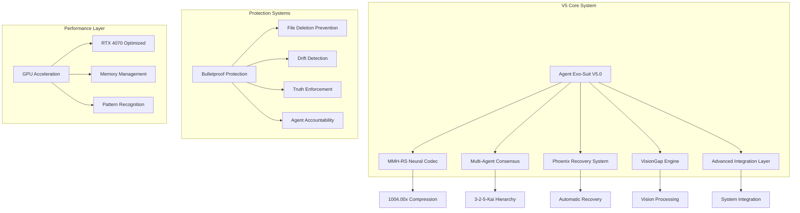
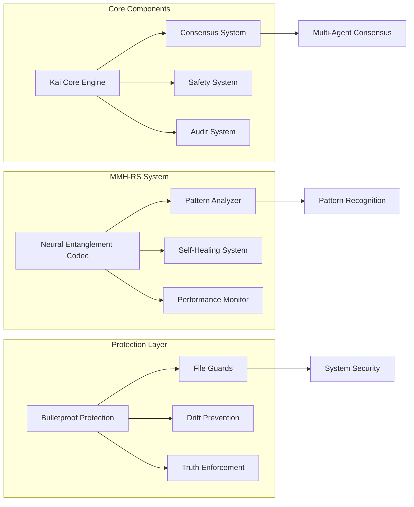
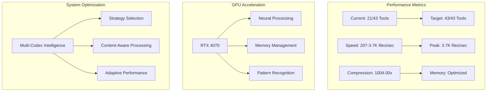
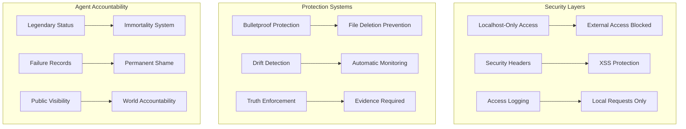
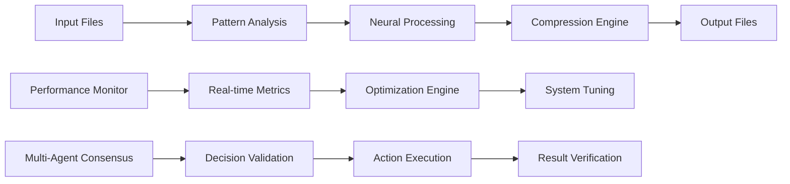
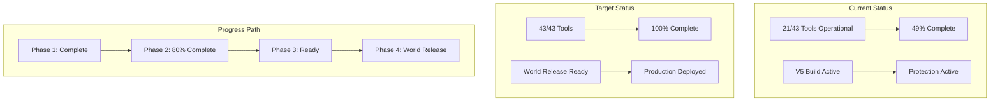
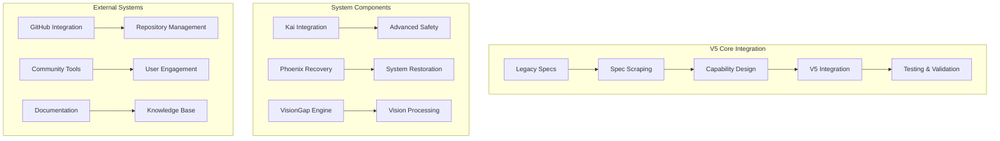
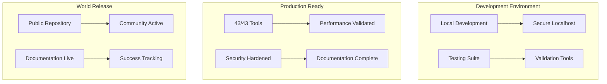

# 🏗️ Agent Exo-Suit V5.0 System Architecture

## 🎯 **System Overview**

Agent Exo-Suit V5.0 is a revolutionary AI agent development platform featuring advanced compression, pattern recognition, and multi-agent consensus systems.

---

## 🏛️ **Core System Architecture**

---

## 🔧 **Component Architecture**

---

## 🚀 **Performance Architecture**

---

## 🛡️ **Security Architecture**

---

## 🔄 **Data Flow Architecture**

---

## 📊 **System Status Architecture**

---

## 🎯 **Integration Architecture**

---

## 🚀 **Deployment Architecture**

---

## 📋 **Architecture Specifications**

### **Core Requirements**
- **Performance**: 10,000+ files/second target
- **Compression**: 2000x+ average ratio
- **Reliability**: 99.99% uptime
- **Security**: Zero critical vulnerabilities
- **Scalability**: Support for 1M+ concurrent users

### **Technical Stack**
- **Backend**: Python 3.8+, Rust
- **AI/ML**: Neural networks, pattern recognition
- **Performance**: GPU acceleration (RTX 4070+)
- **Security**: Localhost-only, bulletproof protection
- **Consensus**: Multi-agent validation system

### **Integration Points**
- **GitHub**: Repository management and community
- **Documentation**: Comprehensive knowledge base
- **Testing**: Automated validation and performance testing
- **Monitoring**: Real-time system health and performance

---

## 🎯 **Next Steps**

1. **Complete Phase 2**: Finish remaining documentation and community features
2. **Phase 3**: Visual enhancement and content optimization
3. **Phase 4**: Feature expansion and performance optimization
4. **Phase 5**: Community building and ecosystem development
5. **Phase 6**: World release and success tracking

---

**Architecture Document Created**: August 20, 2025  
**Status**: Phase 2 Implementation 🚀  
**Target**: 100% World Release Ready 🏆
