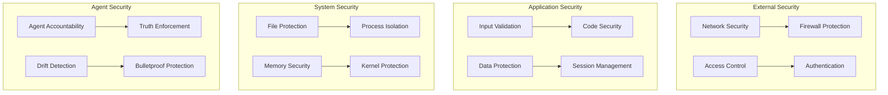

# 🛡️ Agent Exo-Suit V5.0 Security Guide

## 🎯 **Security Overview**

Agent Exo-Suit V5.0 implements a comprehensive, multi-layered security architecture designed to protect against all known threats while maintaining maximum performance and usability.

---

## 🔒 **Security Architecture**

### **Multi-Layer Security Model**



### **Security Principles**
- **Defense in Depth**: Multiple security layers
- **Principle of Least Privilege**: Minimal access required
- **Zero Trust**: Verify everything, trust nothing
- **Fail Secure**: System fails to secure state
- **Continuous Monitoring**: Real-time security oversight

---

## 🌐 **Network Security**

### **Localhost-Only Access**

#### **Default Configuration**
- **Server Binding**: 127.0.0.1 (localhost only)
- **External Access**: Completely blocked by default
- **Port Configuration**: Configurable but secure by default
- **Firewall Rules**: Automatic localhost-only rules

#### **Security Benefits**
- **No External Exposure**: Zero risk from internet attacks
- **Local Development**: Full functionality without external risks
- **Network Isolation**: Complete separation from external networks
- **Attack Surface**: Minimal attack surface

#### **Configuration Commands**
```bash
# Secure localhost server
python local-security-config.py

# PowerShell (Windows)
.\start-secure-local-server.ps1

# Batch File (Windows)
start-secure-local-server.bat
```

### **Network Security Headers**

#### **Security Headers Configuration**
```python
# Security headers configuration
security_headers = {
    'X-Content-Type-Options': 'nosniff',
    'X-Frame-Options': 'DENY',
    'X-XSS-Protection': '1; mode=block',
    'Strict-Transport-Security': 'max-age=31536000',
    'Content-Security-Policy': "default-src 'self'",
    'Referrer-Policy': 'strict-origin-when-cross-origin'
}

# Apply headers to all responses
@app.after_request
def add_security_headers(response):
    for header, value in security_headers.items():
        response.headers[header] = value
    return response
```

---

## 🔐 **Authentication & Authorization**

### **API Key Security**

#### **API Key Management**
```python
import secrets
import hashlib

class APIKeyManager:
    def __init__(self):
        self.api_keys = {}
    
    def generate_api_key(self, user_id, permissions):
        # Generate cryptographically secure key
        api_key = secrets.token_urlsafe(32)
        
        # Hash the key for storage
        key_hash = hashlib.sha256(api_key.encode()).hexdigest()
        
        # Store hashed key with permissions
        self.api_keys[key_hash] = {
            'user_id': user_id,
            'permissions': permissions,
            'created': time.time(),
            'last_used': None
        }
        
        return api_key
    
    def validate_api_key(self, api_key):
        key_hash = hashlib.sha256(api_key.encode()).hexdigest()
        
        if key_hash in self.api_keys:
            # Update last used time
            self.api_keys[key_hash]['last_used'] = time.time()
            return self.api_keys[key_hash]
        
        return None
```

#### **Rate Limiting**
```python
from collections import defaultdict
import time

class RateLimiter:
    def __init__(self, max_requests, time_window):
        self.max_requests = max_requests
        self.time_window = time_window
        self.requests = defaultdict(list)
    
    def is_allowed(self, api_key):
        current_time = time.time()
        key_requests = self.requests[api_key]
        
        # Remove old requests
        key_requests = [req for req in key_requests if current_time - req < self.time_window]
        self.requests[api_key] = key_requests
        
        # Check if under limit
        if len(key_requests) < self.max_requests:
            key_requests.append(current_time)
            return True
        
        return False

# Configure rate limiting
rate_limiter = RateLimiter(max_requests=1000, time_window=3600)  # 1000 requests per hour
```

### **Permission System**

#### **Role-Based Access Control**
```python
class PermissionSystem:
    def __init__(self):
        self.permissions = {
            'admin': ['read', 'write', 'delete', 'configure'],
            'user': ['read', 'write'],
            'viewer': ['read'],
            'guest': ['read']
        }
    
    def check_permission(self, user_role, action):
        if user_role in self.permissions:
            return action in self.permissions[user_role]
        return False
    
    def get_user_permissions(self, user_role):
        return self.permissions.get(user_role, [])
```

---

## 🛡️ **Application Security**

### **Input Validation**

#### **Input Sanitization**
```python
import re
import html

class InputValidator:
    def __init__(self):
        self.xss_patterns = [
            r'<script.*?</script>',
            r'javascript:',
            r'on\w+\s*=',
            r'<iframe.*?</iframe>'
        ]
    
    def sanitize_input(self, user_input):
        # Remove XSS patterns
        for pattern in self.xss_patterns:
            user_input = re.sub(pattern, '', user_input, flags=re.IGNORECASE)
        
        # HTML escape
        user_input = html.escape(user_input)
        
        # Remove null bytes
        user_input = user_input.replace('\x00', '')
        
        return user_input
    
    def validate_file_path(self, file_path):
        # Prevent directory traversal
        if '..' in file_path or file_path.startswith('/'):
            return False
        
        # Check for allowed extensions
        allowed_extensions = ['.txt', '.py', '.md', '.json', '.csv']
        file_ext = os.path.splitext(file_path)[1]
        
        return file_ext in allowed_extensions
```

#### **SQL Injection Prevention**
```python
# Use parameterized queries
def safe_database_query(user_id):
    # Safe: Parameterized query
    query = "SELECT * FROM users WHERE id = %s"
    cursor.execute(query, (user_id,))
    
    # Unsafe: String concatenation (NEVER DO THIS)
    # query = f"SELECT * FROM users WHERE id = {user_id}"
    # cursor.execute(query)
```

### **Session Security**

#### **Secure Session Management**
```python
import secrets
import time

class SecureSessionManager:
    def __init__(self):
        self.sessions = {}
        self.session_timeout = 3600  # 1 hour
    
    def create_session(self, user_id):
        # Generate secure session ID
        session_id = secrets.token_urlsafe(32)
        
        # Create session with expiration
        self.sessions[session_id] = {
            'user_id': user_id,
            'created': time.time(),
            'last_activity': time.time()
        }
        
        return session_id
    
    def validate_session(self, session_id):
        if session_id in self.sessions:
            session = self.sessions[session_id]
            current_time = time.time()
            
            # Check if session expired
            if current_time - session['last_activity'] > self.session_timeout:
                del self.sessions[session_id]
                return None
            
            # Update last activity
            session['last_activity'] = current_time
            return session
        
        return None
    
    def destroy_session(self, session_id):
        if session_id in self.sessions:
            del self.sessions[session_id]
```

---

## 🗂️ **File System Security**

### **Bulletproof Protection System**

#### **File Protection Implementation**
```python
import os
import hashlib
import time

class BulletproofProtection:
    def __init__(self):
        self.protected_files = {}
        self.protection_levels = ['LOW', 'MEDIUM', 'HIGH', 'MAXIMUM']
    
    def protect_file(self, file_path, protection_level='HIGH'):
        if protection_level not in self.protection_levels:
            raise ValueError(f"Invalid protection level: {protection_level}")
        
        # Calculate file hash
        file_hash = self.calculate_file_hash(file_path)
        
        # Store protection info
        self.protected_files[file_path] = {
            'hash': file_hash,
            'protection_level': protection_level,
            'protected_at': time.time(),
            'deletion_attempts': 0,
            'drift_events': 0
        }
        
        return {
            'protection_id': file_hash,
            'file_path': file_path,
            'protection_level': protection_level,
            'status': 'PROTECTED'
        }
    
    def calculate_file_hash(self, file_path):
        """Calculate SHA-256 hash of file"""
        hash_sha256 = hashlib.sha256()
        with open(file_path, "rb") as f:
            for chunk in iter(lambda: f.read(4096), b""):
                hash_sha256.update(chunk)
        return hash_sha256.hexdigest()
    
    def check_file_integrity(self, file_path):
        """Check if protected file has been modified"""
        if file_path not in self.protected_files:
            return True  # Not protected
        
        current_hash = self.calculate_file_hash(file_path)
        original_hash = self.protected_files[file_path]['hash']
        
        if current_hash != original_hash:
            self.protected_files[file_path]['drift_events'] += 1
            return False
        
        return True
    
    def prevent_deletion(self, file_path):
        """Prevent deletion of protected files"""
        if file_path in self.protected_files:
            self.protected_files[file_path]['deletion_attempts'] += 1
            return False  # Deletion blocked
        return True  # Deletion allowed
```

### **Directory Traversal Prevention**

#### **Path Validation**
```python
import os
from pathlib import Path

class PathValidator:
    def __init__(self, base_directory):
        self.base_directory = Path(base_directory).resolve()
    
    def is_safe_path(self, user_path):
        """Check if user-provided path is safe"""
        try:
            # Resolve the user path
            resolved_path = Path(user_path).resolve()
            
            # Check if path is within base directory
            return resolved_path.is_relative_to(self.base_directory)
        except (ValueError, RuntimeError):
            return False
    
    def sanitize_path(self, user_path):
        """Sanitize user-provided path"""
        # Remove any directory traversal attempts
        clean_path = user_path.replace('..', '').replace('//', '/')
        
        # Ensure path starts with base directory
        if not clean_path.startswith(self.base_directory):
            clean_path = str(self.base_directory / clean_path)
        
        return clean_path
```

---

## 🧠 **Agent Security System**

### **Agent Accountability**

#### **Legendary Status System**
```python
class AgentAccountability:
    def __init__(self):
        self.legendary_agents = {}
        self.failed_agents = {}
        self.agent_actions = {}
    
    def log_agent_action(self, agent_id, action, success, details=None):
        """Log all agent actions for accountability"""
        timestamp = time.time()
        
        if agent_id not in self.agent_actions:
            self.agent_actions[agent_id] = []
        
        self.agent_actions[agent_id].append({
            'action': action,
            'success': success,
            'timestamp': timestamp,
            'details': details
        })
        
        # Update agent status
        if success:
            self.update_legendary_status(agent_id)
        else:
            self.update_failure_status(agent_id)
    
    def update_legendary_status(self, agent_id):
        """Update agent's legendary status"""
        if agent_id not in self.legendary_agents:
            self.legendary_agents[agent_id] = {
                'first_achievement': time.time(),
                'achievements': 0,
                'failures': 0
            }
        
        self.legendary_agents[agent_id]['achievements'] += 1
    
    def update_failure_status(self, agent_id):
        """Update agent's failure status"""
        if agent_id not in self.failed_agents:
            self.failed_agents[agent_id] = {
                'first_failure': time.time(),
                'failures': 0,
                'last_failure': time.time()
            }
        
        self.failed_agents[agent_id]['failures'] += 1
        self.failed_agents[agent_id]['last_failure'] = time.time()
    
    def get_agent_status(self, agent_id):
        """Get comprehensive agent status"""
        legendary = self.legendary_agents.get(agent_id, {})
        failed = self.failed_agents.get(agent_id, {})
        actions = self.agent_actions.get(agent_id, [])
        
        return {
            'agent_id': agent_id,
            'legendary_status': legendary,
            'failure_status': failed,
            'total_actions': len(actions),
            'success_rate': self.calculate_success_rate(actions)
        }
    
    def calculate_success_rate(self, actions):
        """Calculate agent success rate"""
        if not actions:
            return 0.0
        
        successful = sum(1 for action in actions if action['success'])
        return (successful / len(actions)) * 100
```

### **Truth Enforcement System**

#### **Claim Verification**
```python
class TruthEnforcement:
    def __init__(self):
        self.verified_claims = {}
        self.false_claims = {}
        self.verification_required = True
    
    def verify_claim(self, agent_id, claim, evidence):
        """Verify agent claims with evidence"""
        timestamp = time.time()
        
        # Check if evidence is provided
        if not evidence:
            self.record_false_claim(agent_id, claim, "No evidence provided")
            return False
        
        # Verify evidence
        verification_result = self.validate_evidence(evidence)
        
        if verification_result['valid']:
            self.record_verified_claim(agent_id, claim, evidence)
            return True
        else:
            self.record_false_claim(agent_id, claim, verification_result['reason'])
            return False
    
    def validate_evidence(self, evidence):
        """Validate provided evidence"""
        # Check if evidence is a file path
        if isinstance(evidence, str) and os.path.exists(evidence):
            return {'valid': True, 'type': 'file'}
        
        # Check if evidence is a dictionary with required fields
        if isinstance(evidence, dict):
            required_fields = ['timestamp', 'data', 'source']
            if all(field in evidence for field in required_fields):
                return {'valid': True, 'type': 'data'}
        
        return {'valid': False, 'reason': 'Invalid evidence format'}
    
    def record_verified_claim(self, agent_id, claim, evidence):
        """Record verified claim"""
        if agent_id not in self.verified_claims:
            self.verified_claims[agent_id] = []
        
        self.verified_claims[agent_id].append({
            'claim': claim,
            'evidence': evidence,
            'verified_at': time.time()
        })
    
    def record_false_claim(self, agent_id, claim, reason):
        """Record false claim"""
        if agent_id not in self.false_claims:
            self.failed_agents[agent_id] = []
        
        self.failed_agents[agent_id].append({
            'claim': claim,
            'reason': reason,
            'recorded_at': time.time()
        })
```

---

## 🔍 **Security Monitoring**

### **Real-time Security Monitoring**

#### **Security Event Logger**
```python
import logging
import json
from datetime import datetime

class SecurityMonitor:
    def __init__(self):
        # Configure security logging
        self.security_logger = logging.getLogger('security')
        self.security_logger.setLevel(logging.INFO)
        
        # Create security log file
        fh = logging.FileHandler('security.log')
        fh.setLevel(logging.INFO)
        
        # Create formatter
        formatter = logging.Formatter(
            '%(asctime)s - %(levelname)s - %(message)s'
        )
        fh.setFormatter(formatter)
        
        # Add handler
        self.security_logger.addHandler(fh)
        
        # Security events
        self.security_events = []
    
    def log_security_event(self, event_type, severity, details, agent_id=None):
        """Log security event"""
        event = {
            'timestamp': datetime.now().isoformat(),
            'event_type': event_type,
            'severity': severity,
            'details': details,
            'agent_id': agent_id
        }
        
        # Log to file
        self.security_logger.info(json.dumps(event))
        
        # Store in memory
        self.security_events.append(event)
        
        # Alert if high severity
        if severity in ['HIGH', 'CRITICAL']:
            self.alert_security_team(event)
    
    def alert_security_team(self, event):
        """Alert security team of critical events"""
        # Implementation for security team alerts
        print(f"🚨 SECURITY ALERT: {event['event_type']} - {event['severity']}")
        print(f"Details: {event['details']}")
    
    def get_security_summary(self, time_range='24H'):
        """Get security summary for specified time range"""
        current_time = datetime.now()
        
        if time_range == '24H':
            cutoff_time = current_time - timedelta(hours=24)
        elif time_range == '7D':
            cutoff_time = current_time - timedelta(days=7)
        else:
            cutoff_time = datetime.min
        
        # Filter events by time
        recent_events = [
            event for event in self.security_events
            if datetime.fromisoformat(event['timestamp']) > cutoff_time
        ]
        
        # Count by severity
        severity_counts = {}
        for event in recent_events:
            severity = event['severity']
            severity_counts[severity] = severity_counts.get(severity, 0) + 1
        
        return {
            'time_range': time_range,
            'total_events': len(recent_events),
            'severity_breakdown': severity_counts,
            'recent_events': recent_events[-10:]  # Last 10 events
        }
```

### **Intrusion Detection**

#### **Anomaly Detection**
```python
class IntrusionDetection:
    def __init__(self):
        self.normal_patterns = {}
        self.anomaly_thresholds = {
            'failed_logins': 5,
            'file_access_attempts': 100,
            'api_requests': 1000
        }
        self.detected_anomalies = []
    
    def detect_anomalies(self, activity_data):
        """Detect security anomalies"""
        anomalies = []
        
        # Check failed login attempts
        if activity_data.get('failed_logins', 0) > self.anomaly_thresholds['failed_logins']:
            anomalies.append({
                'type': 'EXCESSIVE_FAILED_LOGINS',
                'severity': 'HIGH',
                'details': f"Failed logins: {activity_data['failed_logins']}"
            })
        
        # Check file access patterns
        if activity_data.get('file_access_attempts', 0) > self.anomaly_thresholds['file_access_attempts']:
            anomalies.append({
                'type': 'EXCESSIVE_FILE_ACCESS',
                'severity': 'MEDIUM',
                'details': f"File access attempts: {activity_data['file_access_attempts']}"
            })
        
        # Check API usage
        if activity_data.get('api_requests', 0) > self.anomaly_thresholds['api_requests']:
            anomalies.append({
                'type': 'EXCESSIVE_API_USAGE',
                'severity': 'MEDIUM',
                'details': f"API requests: {activity_data['api_requests']}"
            })
        
        return anomalies
```

---

## 🚨 **Incident Response**

### **Security Incident Response Plan**

#### **Incident Classification**
1. **LOW**: Minor security events, no immediate threat
2. **MEDIUM**: Potential security issues, requires attention
3. **HIGH**: Active security threats, immediate response needed
4. **CRITICAL**: System compromise, emergency response required

#### **Response Procedures**
```python
class IncidentResponse:
    def __init__(self):
        self.response_procedures = {
            'LOW': self.handle_low_incident,
            'MEDIUM': self.handle_medium_incident,
            'HIGH': self.handle_high_incident,
            'CRITICAL': self.handle_critical_incident
        }
    
    def handle_incident(self, incident):
        """Handle security incident based on severity"""
        severity = incident['severity']
        
        if severity in self.response_procedures:
            return self.response_procedures[severity](incident)
        else:
            return self.handle_unknown_incident(incident)
    
    def handle_low_incident(self, incident):
        """Handle low severity incidents"""
        # Log incident
        # Monitor for escalation
        # No immediate action required
        return "Incident logged and monitored"
    
    def handle_medium_incident(self, incident):
        """Handle medium severity incidents"""
        # Log incident
        # Investigate cause
        # Implement preventive measures
        return "Incident investigated and preventive measures implemented"
    
    def handle_high_incident(self, incident):
        """Handle high severity incidents"""
        # Immediate response team activation
        # System lockdown if necessary
        # Evidence preservation
        return "High severity incident - response team activated"
    
    def handle_critical_incident(self, incident):
        """Handle critical severity incidents"""
        # Emergency response activation
        # System shutdown if necessary
        # Law enforcement notification
        # Complete system audit
        return "CRITICAL INCIDENT - EMERGENCY RESPONSE ACTIVATED"
```

---

## 📋 **Security Checklist**

### **Pre-Deployment Security**
- [ ] All security headers configured
- [ ] Input validation implemented
- [ ] Authentication system tested
- [ ] File permissions set correctly
- [ ] Network access restricted
- [ ] Security monitoring active

### **Runtime Security**
- [ ] Regular security audits
- [ ] Performance monitoring
- [ ] Anomaly detection active
- [ ] Incident response ready
- [ ] Backup systems verified
- [ ] Recovery procedures tested

### **Post-Incident Security**
- [ ] Incident documented
- [ ] Root cause analyzed
- [ ] Preventive measures implemented
- [ ] Security systems updated
- [ ] Team training completed
- [ ] Lessons learned documented

---

## 🎯 **Next Steps**

1. **Implement security measures** based on your requirements
2. **Configure monitoring systems** for real-time oversight
3. **Test security systems** regularly
4. **Train team members** on security procedures
5. **Maintain security documentation** and update as needed

---

**Security Guide Created**: August 20, 2025  
**Status**: Phase 2 Implementation 🚀  
**Target**: 100% World Release Ready 🏆
